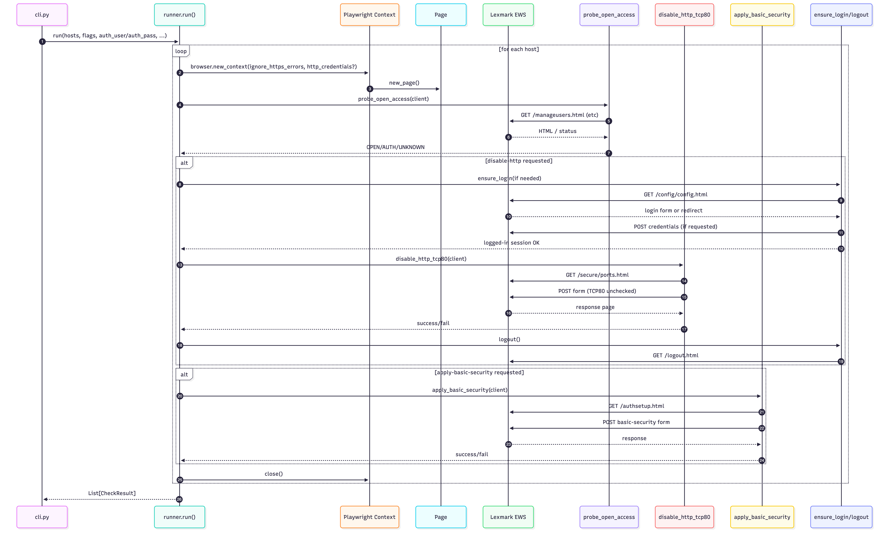

# Lexmark Security Auditor (EWS)

<p align="center">
  <a href="https://pypi.org/project/lexmark-security-auditor/">
    
  </a>
  <a href="https://pypi.org/project/Lexmark-security-auditor/">
    
  </a>
  <a href="https://github.com/hacktivism-github/netauto/blob/development/LICENSE">
    
  </a>
</p>


Enterprise-grade security auditing and hardening tool for Lexmark MX710 (and compatible models) via Embedded Web Server (EWS).

Built with Playwright + Python, this tool enables controlled, automated security enforcement at scale.

## Overview

The __Lexmark Security Auditor__ was developed to:

- Audit administrative exposure on Lexmark printers

- Enforce Basic Security (username/password protection)

- Disable insecure services (e.g., TCP 80 – HTTP)

- Operate at scale across multiple devices

- Provide CSV/JSON reporting for governance & compliance

Designed with a __modular architecture__, the tool separates:

- Authentication logic

- Port configuration logic

- Security workflows

- Runner orchestration

- CLI interface

## Key Features
### Security Audit

- Detects if admin/security pages are:

    - OPEN

    - AUTH required

    - UNKNOWN

- Identifies exposure via:

    - /auth/manageusers.html

    - login redirects

    - HTTP status codes

## Basic Security Enforcement

Automates:

1. Navigate to:

```
/cgi-bin/dynamic/config/config.html
```
2. Access
```
Configurações → Segurança → Configuração de segurança
```
3. Configure:

    - Authentication Type: ```UsernamePassword```

    - Admin ID

    - Password

4. Apply configuration
---
## HTTP Hardening (TCP 80 Disable)

- Authenticates via form-based login

- Navigates to:
```
/cgi-bin/dynamic/config/secure/ports.html
```
- Unchecks
```
TCP 80 (HTTP)
```
- Submits configuration

- Verifies idempotently

- Performs logout

✔ Idempotent (safe to run multiple times)

✔ Safe retry logic

✔ Session-aware

---
## Architecture 
```
lexmark_security_auditor/
│
├── cli.py
├── runner.py
│
├── models.py
├── ews_client.py
│
└── workflows/
    ├── auth.py
    ├── basic_security.py
    ├── probe.py
    └── ports.py
```
---
| Module              | Responsibility                 |
| ------------------- | ------------------------------ |
| `runner.py`         | Orchestration & decision logic |
| `auth.py`           | Session handling & login       |
| `ports.py`          | TCP 80 disable logic           |
| `basic_security.py` | Admin security enforcement     |
| `probe.py`          | Exposure detection             |
| `ews_client.py`     | EWS navigation abstraction     |

---



---

## Installation (Development Mode)

From project root:
```
pip install -e .
```

This enables:
```
lexmark-audit ...
```

Or:

```
python -m lexmark_security_auditor.cli ...
```
---

## Usage Examples

__Note:__ If you're on Powershell replace the ``` \ ``` by ``` ` ```

### Audit Only
```
lexmark-audit \
  --hosts printers.txt \
  --https
```
### Apply Basic Security
```
lexmark-audit \
  --hosts printers.txt \
  --https \
  --apply-basic-security \
  --new-admin-user <ID do usuário> \
  --new-admin-pass "Senha"
  ```

### Disable HTTP (Authenticated)
```
lexmark-audit \
  --hosts printers.txt \
  --https \
  --disable-http \
  --auth-user <ID do usuário> \
  --auth-pass "Senha"
```
### With Reporting
```
lexmark-audit \
  --hosts printers.txt \
  --https \
  --disable-http \
  --auth-user <ID do usuário> \
  --auth-pass "Senha" \
  --report-csv report.csv
  ```
---
## Output Fields (CSV/JSON)

| Field                  | Description           |
| ---------------------- | --------------------- |
| host                   | Printer IP            |
| probe_result           | OPEN / AUTH / UNKNOWN |
| evidence               | Detection details     |
| basic_security_applied | Boolean               |
| http_disabled          | Boolean               |
| status                 | ok / timeout / error  |
| error                  | Error message         |

---

## Security Considerations

- Credentials are passed via CLI (consider secure vault integration)

- HTTPS recommended

- Designed for internal network use

- Session cookies handled via Playwright context

- Idempotent operations to avoid configuration drift

## Design Principles

- Modular

- Idempotent

- Stateless between hosts

- Session-aware

- Explicit authentication

- Clear separation of concerns

- Enterprise reporting ready

## Requirements

- Python 3.9+

- Playwright

- Chromium (installed via playwright install)

## Roadmap (Future Enhancements)

- Vault integration (HashiCorp)

- SNMP configuration hardening

- Parallel host execution

- Compliance summary dashboard

- Unit test coverage

- Docker container image

## License

Internal Enterprise Use
© 2026